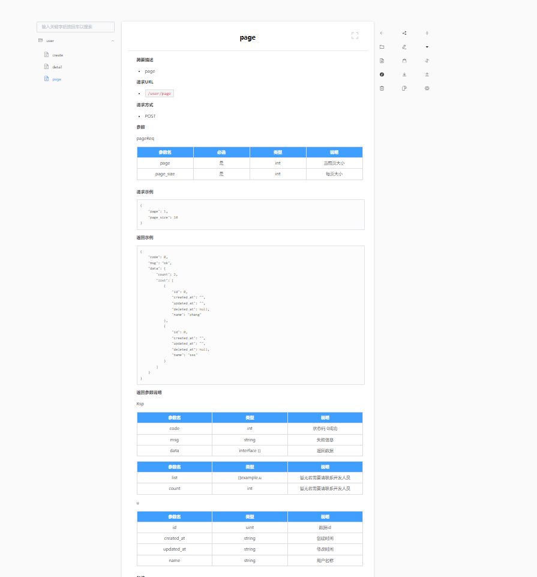

# transfDoc

golang集成showdoc 调取接口自动生成在线文档

1、在showdoc文档中获取apikey、apitoken、showdocurl写入配置文件中

若公有showdoc showdocurl: https://www.showdoc.cc/server/api/item/updateByApi

若私有showdoc showdocurl: http://xx.com/server/index.php?s=/api/item/updateByApi

2、在路由层添加前置拦截获取请求体(DocOpen 1生成showdoc 2生成markdown 0不作任何操作(发布线上请传0))

tool.EnableDoc(1, tool.Doc{ \
Url:      "https://www.showdoc.cc/server/api/item/updateByApi", \
ApiKey:   "06f5a93cbfe1c481d0fc20cf7d6692b92034679355", \
ApiToken: "061f631ecd83adaef9d91ed3616f7db71466087183", }, tool.Gin{})\
可自己实现Option接口后传入

3、在控制层post获取参数请使用tool.BindJSON()或者tool.BindBindJSONNotWithValidate()

tool.BindJSON会对struct使用validator进行参数校验 如果json非struct或者无需校验使用tool.BindBindJSONNotWithValidate

4、响应使用replyjson.go文件中的ReplyJson方法或者使用rsp.go

5、测试 在请求头中传入dir(文件夹名称) title(接口名称)

5、若请求参数不需要某些字段请使用 req:"-",若返回参数中不需要某些字段请使用resp:"-",若必填validate:"required"(结合validate参数校验),说明则是 comment:"aa"或者`gorm:"
comment:'数据id'"， 参数名使用json:"id"。若无json则不会在请求参数、返回参数中显示该字段,具体可拉取代码运行参照build

6、因为请求头无法传入中文所以需要进行转码 postman右键有个EncodeUrlComponent 例如：

curl --location --request POST '127.0.0.1:8080/user/create' \
--header 'dir: test' \
--header 'title: %E7%94%A8%E6%88%B7%E5%88%9B%E5%BB%BA' \
--header 'Content-Type: application/json' \
--data-raw '{
"name":"ss"
}'

生成好的文档路径
https://www.showdoc.com.cn/1263702264386833?page_id=6757279023421409

7、如需其它框架ShowDoc、Markdown文档生成实现Option接口、使用doc.go中的BindJSON以及使用replyJson.go中ReplyJson方法即可 详细参考Gin实现以及示例中的Rsp返回

8、如需其它数据源请看gitee.com/yanggit123/tool